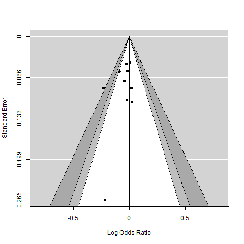
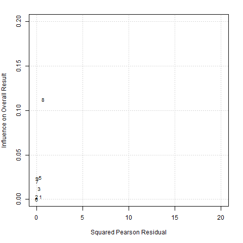
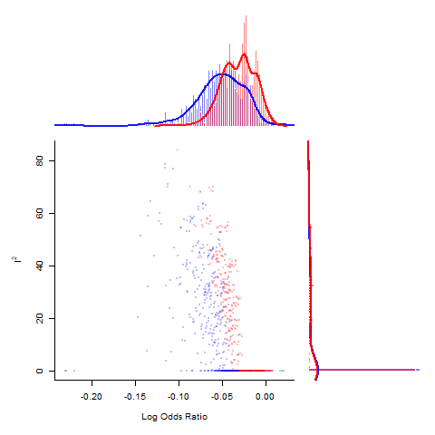

# Metaanalysis

This project contains several metaanalyses in neurological diseases: Spot sign, Vertigo, Hypoxic-Coma and Coma. The projects are developed within the subfolders and grouped according to the type of meta-analysis: Proportions and Diagnostic Test. The work horse for meta-analysis is metafor (http://www.metafor-project.org/doku.php/analyses)

## PRISMA

The first part of any metaanalysis is the PRISMA statement. This flow diagram can be generated within R using the _PRISMAstatement_ library. The example provided uses data from the Spot Sign project.

## Proportion

A variety of different methods for calculating the 95% confidence interval of the binomial distribution. The mean of the binomial distribution is given by p and the variance by $\frac{p \times (1-p)}{n}$. The term $z$ is given    by $1-\frac{\alpha}{2}$ quantile of normal distribution. A standard way of calculating the confidence interval is the Wald method $p\pm z\times \sqrt{\frac{p \times(1-p)}{n}}$. The Freeman-Tukey double arcsine transformation tries to transform the data to a normal distribution. This approach is useful for handling when occurence of event is rare. The exact or Clopper-Pearson method is suggested as the most conservative of the methods for calculating confidence interval for proportion. It is based on cumulative properties of the binomial distribution. The Wilson method has similarities to the Wald method. It has an extra term $z^2/n$. There are many different methods for calculating the confidence interval for proportions. Investigators such as Agresti proposed that approximate methods are better than exact method. This project is also under development. 

The example below uses Freeman-Tukey double arcsine transformation from the metafor package. The exact method can be performed in a smilar way by by using the binomial.test function and passing the results to forest plot. The Wilson method can be added using similar approach.

```R
library(metafor) #open software metafor
#create data frame dat for TIA data
#xi is numerator
#ni is denominator
dat <- data.frame(model=c("melbourne","paris","oxford","stanford","ottawa","new zealand"),
xi=c(7,7,6,2,31,2), 
ni=c(468,296, 281,223,982,172))
#calculate new variable pi base on ratio xi/ni
dat$pi <- with(dat, xi/ni)
#Freeman-Tukey double arcsine trasformation
dat <- escalc(measure="PFT", xi=xi, ni=ni, data=dat, add=0)	
res <- rma(yi, vi, method="REML", data=dat, slab=paste(model))
#create forest plot with labels
forest(res, transf=transf.ipft.hm, targs=list(ni=dat$ni), xlim=c(-1,1.5),refline=0.020,cex=.8, ilab=cbind(dat$xi, dat$ni),
       ilab.xpos=c(-.6,-.4),digits=3)
op <- par(cex=.75, font=2)
text(-1.0, 7.5, "model ",pos=4)
text(c(-.55,-.2), 7.5, c("recurrence", " total subjects"))
text(1.4,7.5, "frequency [95% CI]", pos=2)
par(op)
```

### TIA

This metaanalysis examines the rate of stroke recurrence following management in rapid TIA clinic. 

### Aneurysm

This metaanalysis is designed to examine the rate of rupture of aneurysm. The choice of method depends on whether the rate of rupture is framing of the confidence interval. This study is in development.

### First Seizure

This meta-analysis is designed to evaluate the risk of seizure recurrence following an unprovoked seizure. This study is in development.


## Diagnostic test

There are several approaches to evaluation of diagnostic studies. The current approach is the bivariate method of Reitmas. The QUADAS2 tool is available at 
https://annals.org/aim/fullarticle/474994/quadas-2-revised-tool-quality-assessment-diagnostic-accuracy-studies

### Hypoxic-Coma

This work has been published (Neurology 2010;74:572). The data is deposited in this repository. This study met the criteria for inclusion in the Database of Abstracts of Reviews of Effects (DARE): Quality-assessed Reviews https://www.ncbi.nlm.nih.gov/books/NBK285222/

### ABCD2

This work has been published (Neurology 2012;79: 971). This study met the criteria for inclusion in the Database of Abstracts of Reviews of Effects (DARE): Quality-assessed Reviews https://www.ncbi.nlm.nih.gov/books/NBK285222/

### Spot-Sign (Frequentist)

The spot sign on CTA is used to predict hematoma growth and clinical outcome. The current project uses mada package on CRAN. It uses a bivariate method to assess spot sign as diagnostic test. There's also illustration of metaregression. It also contains codes for assessing positive predictive value. The codes are available in .Rmd document. Data were entered via Survey Monkey. This work has been published in journal Stroke at https://www.ahajournals.org/doi/10.1161/STROKEAHA.118.024347

### Vertigo (Bayesian)

This metaanalysis is designed to look at HINT examination as bedside test for diagnosis of central or peripheral vertigo. In contrast to the above work, this one is in development. It will use the bivariate method for metaanalysis. The variation on the Spot-Sign project will be the use of Bayesian approach to metaanalysis. Data will be entered via RedCap. 

## Clinical-Trials

### RCT
Revman is an excellent tool for performing meta-analysis of trials. Here we will use metafor package, see rct.Rmd. The following methods are demonstrated: fixed effect and random effect analyses, forest plot, funnel plot (for exploring publication bias), Baujat plot (for exploring source of heterogeneity) and GOSH plot (for exploring study heterogeneity using output of fixed effect model for all possible subsets)

Funnel plot


Baujat plot


GOSH plot


Metafor has routines for performing subplots using the subset function. Another way is to use the forestplot library in the example below
```r
rmeta_conf <- 
  structure(list(
    mean  = c(NA, NA, exp(-0.0676), exp(-0.0266),  NA, exp(-0.0352)), 
    lower = c(NA, NA, exp(-0.1873), exp(-0.0715),  NA, exp(-0.0753)),
    upper = c(NA, NA, exp(0.0520), exp(0.0183),  NA, exp(0.0049))),
    .Names = c("mean", "lower", "upper"), 
    row.names = c(NA, -6L), 
    class = "data.frame")

#table data
tabletext<-cbind(c("","Trials","wide","narrow",NA,"Summary"),
                 c("Events","(Drugs)","1052","4878",NA,NA),
                 c("Events","(Control)","1109","4962",NA,NA),     
                 c("","OR","0.934","0.0974",NA,"0.965")
)

#use forestplot
library(forestplot)
forestplot(tabletext, 
           rmeta_conf,new_page = TRUE,
           is.summary=c(TRUE,TRUE,rep(FALSE,8),TRUE),
           clip=c(0.1,2.5), 
           xlog=TRUE, 
           col=fpColors(box="royalblue",line="darkblue", summary="royalblue"))
```

### Network-Metaanalysis

This project is under development. There are several methods varying between frequentist (netmeta) to Bayesian methods (nmalINLA and gemtc). 

## Git commands

The github repository was created in git bash

```git
git init
git remote add origin https://github.com/GNtem2/Metaanalysis.git
git push -u origin master
```