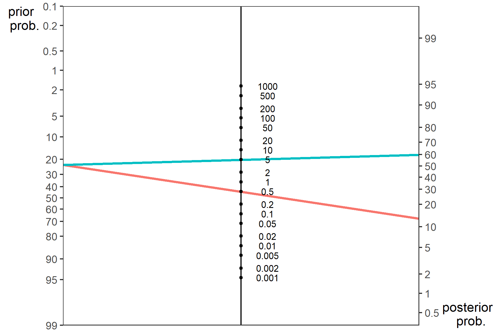
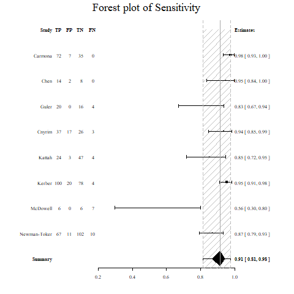
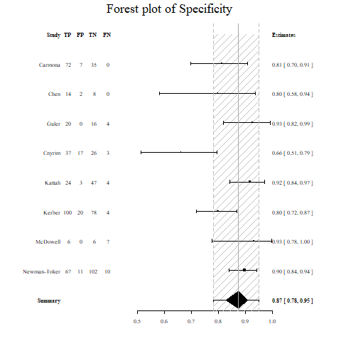
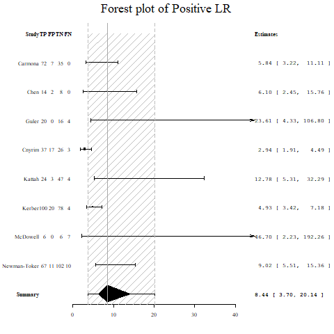
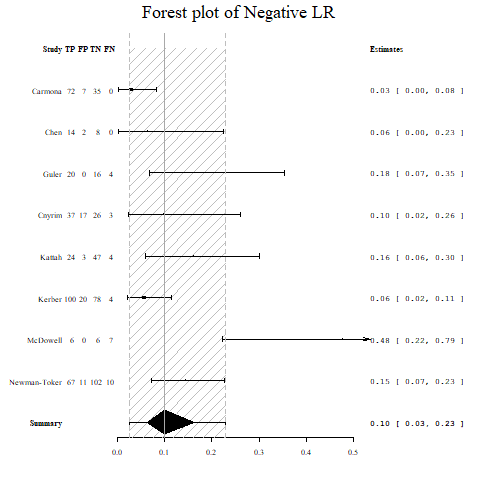

# Metaanalysis

This project contains several metaanalyses in neurological diseases: Spot sign, Vertigo, Hypoxic-Coma and Coma. The projects are developed within the subfolders and grouped according to the type of meta-analysis: Proportions and Diagnostic Test. The work horse for meta-analysis is metafor (http://www.metafor-project.org/doku.php/analyses). Practical guides for metaanalysis are available at JAMA Surg. 2020;155(5):430-431 (general guide),  BMJ 2019;364:k4597 (prognostic studies).

## Search strategy

## Random vs Fixed effect

Fixed effect (Peto or Mantel-Haenszel) approaches assume that the population is the same for all studies and thus each study is the source of error. Random effect (DerSimonian Laird) assumes an additional source of error between studies.The random effect approach results in more conservate estimate of effect size confidence interval. A criticism of DerSimnonian and Laird approach is that it is prone to type I error especially when the number of number of studies is small (n<20) or moderate heterogeneity. It's estimated that 25% of the significant findings with DerSimonian Laird method may be non-significant with Hartung-Knapp method (BMC Medical Research Methodology 2014, 14:25). The Hartung-Knapp method (Stat Med 2001;20:3875-89) estimate the between studies variance and treat it as fixed. It employs quantile of t-distribution rather than normal distribution. The Hartung-Knapp method is available in _meta_ and _metafor_ package.

## Tidy data

Attention to collection of data is important as it shows the way for performing analysis. In general each row represents a variable (ie study ID) and each column represents an attribute of that variables (ie year of publication, TP, FP, FN, TN, duplicate study (yes or no) etc). Sometimes there is a temptation to embed 2 types of attributes into a column. An example would be "no duplicate keep". This column should ideally be splitted into duplicate (yes or no) and another column retain (yes or no). A sensible approach is to conceptualise how the data can be analysed in R. R provides a number of packages for subsetting or filtering of studies. As such there is no need to create multiple copies of the same data with subsequent files having the files studies removed. A better approach is to keep adding data into subsequent rows and use a column retain (yes or no) to identify the studies for analysis. In this case, you can use dplyr::filter (dat, retain=="yes") to subset the studies. This is sensible as later you may deemed that these studies should be kept in the analysis and so there is no need to do a hard remove in the excel file. An example of a tidy dataset is provided in 150718.csv under Spot-Sign folder.

## PRISMA

The first part of any metaanalysis is the PRISMA statement. This flow diagram can be generated within R using the _PRISMAstatement_ library. The example provided uses data from the Spot Sign project. An alternative approach is to use the _DiagrammeR_ library.


## Proportion

A variety of different methods for calculating the 95% confidence interval of the binomial distribution. The mean of the binomial distribution is given by p and the variance by $\frac{p \times (1-p)}{n}$. The term $z$ is given    by $1-\frac{\alpha}{2}$ quantile of normal distribution. A standard way of calculating the confidence interval is the Wald method $p\pm z\times \sqrt{\frac{p \times(1-p)}{n}}$. The Freeman-Tukey double arcsine transformation tries to transform the data to a normal distribution. This approach is useful for handling when occurence of event is rare. The exact or Clopper-Pearson method is suggested as the most conservative of the methods for calculating confidence interval for proportion. It is based on cumulative properties of the binomial distribution. The Wilson method has similarities to the Wald method. It has an extra term $z^2/n$. There are many different methods for calculating the confidence interval for proportions. Investigators such as Agresti proposed that approximate methods are better than exact method. This project is also under development. 

The example below uses Freeman-Tukey double arcsine transformation from the metafor package. The exact method can be performed in a smilar way by by using the binomial.test function and passing the results to forest plot. The Wilson method can be added using similar approach.

```R
library(metafor) #open software metafor
#create data frame dat for TIA data
#xi is numerator
#ni is denominator
dat <- data.frame(model=c("melbourne","paris","oxford","stanford","ottawa","new zealand"),
xi=c(7,7,6,2,31,2), 
ni=c(468,296, 281,223,982,172))
#calculate new variable pi base on ratio xi/ni
dat$pi <- with(dat, xi/ni)
#Freeman-Tukey double arcsine trasformation
dat <- escalc(measure="PFT", xi=xi, ni=ni, data=dat, add=0)	
res <- rma(yi, vi, method="REML", data=dat, slab=paste(model))
#create forest plot with labels
forest(res, transf=transf.ipft.hm, targs=list(ni=dat$ni), xlim=c(-1,1.5),refline=0.020,cex=.8, ilab=cbind(dat$xi, dat$ni),
       ilab.xpos=c(-.6,-.4),digits=3)
op <- par(cex=.75, font=2)
text(-1.0, 7.5, "model ",pos=4)
text(c(-.55,-.2), 7.5, c("recurrence", " total subjects"))
text(1.4,7.5, "frequency [95% CI]", pos=2)
par(op)
```

### TIA

This metaanalysis examines the rate of stroke recurrence following management in rapid TIA clinic. The project will combine observational studies and RCT. This study is in development.

### Aneurysm

This metaanalysis is designed to examine the rate of rupture of aneurysm. This study is in development.

### First Seizure

This meta-analysis is designed to evaluate the risk of seizure recurrence following an unprovoked seizure. This study is in development.


## Diagnostic test
The sensitivity of a diagnostic test is the true positive rate and the specificity is the true negative rate. 

AUC
The area under the receiver operating characteristics (ROC) curve or AUC is a measure of the accuracy of the test.An AUC of 0.5 is classified as no better than by chance; 0.8 to 0.89 provides good (excellent) discrimination, and 0.9 to 1.0 provides outstanding discrimination.51 The standard approach adopted in interpreting AUC may not hold true in the presence of heterogeneity.

Likelihood ratio
Positive likelihood ratio (PLR) is the ratio of sensitivity to false positive rate (FPR); the negative (NLR) likelihood ratio is the ratio of 1-sensitivity to specificity. A PLR indicates the likelihood that a positive spot sign (test) would be expected in a patient with ICH (target disorder) compared with the likelihood that the same result would be expected in a patient without ICH. Using the recommendation by Jaeschke et al, a high PLR (>5) and low NLR (<0.2) indicate that the test results would make moderate changes in the likelihood of hematoma growth from baseline risk. PLRs of >10 and NLRs of <0.1 would confer very large changes from baseline risk.
 
Heterogeneity
It is important to look at the inconsistency I2 index. This is the sum of the squared deviations from the overall effect and weighted by the study size. Value <25% is classified as low and greater than 75% as high heterogeneity, It is recommended that meta-regression be used in the presence of high heterogeneity. There are several plots (funnel, baujat, GOSH) for exploring this issue. see below. 

Quality
All studies require evaluation of the quality of the individual studies. This can be done with the QUADAS2 tool, available at 
https://annals.org/aim/fullarticle/474994/quadas-2-revised-tool-quality-assessment-diagnostic-accuracy-studies. 

Example of 2 x 2 table is provided here. As an exercise, consider a paper about a diagnostic test for peripheral vertigo reporting 100% sensitivity and 94.4% specificity. There are 114 patients, 72 patients without stroke have vertigo and positive test findings. Among patients with stroke 7 of 42 have positive test findings.

```r
              Peripheral Vertigo
            Disease Positive     Disease Negative
####################################################
# HIT Test#                 #                      #
# Positive# True Positive   # False Positive       #  
#         #     72          #       7              #
####################################################
# HIT Test#                 #                      #
# Negative# False Negative  # True Negative        #
#         #     0           #       35             # 
####################################################

# Peripheral Vertigo
#Sensitiviy=TP/(TP+FN)=100%
#Specificity=TN/(TN+FP)=83%

####################################################
#If the objective is to diagnose cerebellar stroke then the table should be set up like this

              Cerebellar Stroke
            Disease Positive     Disease Negative
####################################################
# HIT Test#                 #                      #
# Negative# True Positive   # False Positive       #  
#         #     7          #       72              #
####################################################
# HIT Test#                 #                      #
# Positive# False Negative  # True Negative        #
#         #     35           #      0              # 
####################################################

#Stroke
#Sensitiviy=TP/(TP+FN)=17%
#Specificity=TN/(TN+FP)=0%

```

### Hypoxic-Coma

This evaluation of tools for prognosticating hypoxic coma has been published (Neurology 2010;74:572). It assessed absent SEP, EEG (Burst suppression and isoelectric patterns), GCS motor score and asbent pupillary responses. The data (25 studies) from that paper is deposited in this repository. This study met the criteria for inclusion in the Database of Abstracts of Reviews of Effects (DARE): Quality-assessed Reviews https://www.ncbi.nlm.nih.gov/books/NBK285222/. 

It has been 10 years since that meta-analysis and an update is needed given the use of hypothermia in the management of hypoxic coma and the use of other tests including MRI and CT scans, serum neuron-specific enolase. Some of the recent meta-analyses of this topic have described calculation of positive and negative LR but did not provide results for negative LR (Crit Care Med 2014). Another meta-analysis (Intensive Care Med 2013) used the bivariate model to pool sensitivity and false positive rate (1-specificity). A meta-analysis of serum lactate for prediction of coma outcome used odds ratio and hazard ratio rather than traditional method.

### ABCD2

This work on the use of ABCD2 for prognostication of TIA outcome has been published (Neurology 2012;79: 971). Importantly, ABCD2 was not a good tool positive likelihood ratio (PLR) 1.43 (1.33–1.54), negative likelihood ratio (NLR) 0.40 (0.33–0.50), and area under the curve (AUC) 0.70 (0.62–0.78). This study met the criteria for inclusion in the Database of Abstracts of Reviews of Effects (DARE): Quality-assessed Reviews https://www.ncbi.nlm.nih.gov/books/NBK285222/

### Spot-Sign (Frequentist)

The spot sign on CTA has been used to predict hematoma growth and clinical outcome. It was considered as a surrogate for identifying intracerebral hemorrhage for durg trials. Prior approaches to metaanalysis of diagnostic studies use univariate method of Moses-Shapiro-Littenberg and which takes a reductionistic approach (combines information from the sensitivity and specificity). The current recommendation for metaanalysis of diagnostic studies is the bivariate method of Reitmas which preserves the dual nature of the data (sensitivity and specificity) in the treatment of covariates in meta-regression. Similar to the univariate method, the
bivariate method employs a random effect to take into account the within study correlation. Additionally, the bivariate method also accounts for the
between-study correlation in sensitivity and specificity. The current project uses mada package on CRAN. It uses a bivariate method from mada package to assess spot sign as diagnostic test. There's also illustration of metaregression. It also contains codes for assessing positive predictive value. The codes are available in .Rmd document. Revman is a freely available tool from Cochrane but it does not support bivariate analysis. Data were entered via Survey Monkey. This work has been published in journal Stroke at https://www.ahajournals.org/doi/10.1161/STROKEAHA.118.024347. Fagan's normogram can be created using _nomogrammer_ package.

```r
source("https://raw.githubusercontent.com/achekroud/nomogrammer/master/nomogrammer.r")
p<-nomogrammer(Prevalence = .234, Plr = 4.85, Nlr = 0.49)
p+ggtitle("Fagan's normogram for Spot Sign and ICH growth")
ggsave(p,file="Fagan_SpotSign.png",width=5.99,height=3.99,units="in")
```
Fagan's normogram for Spot Sign and ICH growth


### MOGAG (Myelin oligodendrocyte glycoprotein-IgG1–associated disorder)
This metaanalysis is designed to look at MOG antibidies for the diagnosis of MOGAD. The recent paper by Sechi in Jama Neurol 2021 highlighted the problem with with test in patients with multiple sclerosis. In that study, there were 92 positive cases (TP=66, FP=26) resulting in PPV of 72%. In this meta-analysis we will calculate the positive and negative likelihood ratios and post-test probability.


### Vertigo (Bayesian)

This metaanalysis is designed to look at HINT examination as bedside test for diagnosis of peripheral vertigo. In contrast to the above work, this one is in development. A recent meta-analysis of HINT has been published in European Stroke Journal 2019, Vol. 4(3) 233-239. This study did not discussed the method for performing meta-analysis or the treatment of heterogeneity. Further the data was presented as risk ratio, a non-traditional approach to diagnostic test.

It will use the bivariate method from meta4diag package for metaanalysis. The variation on the Spot-Sign project will be the use of Bayesian approach to metaanalysis. The choice of Bayesian method is due to the small number of available studies (n<20), spare data, and which can pose a problem with convergence when performing numeric approach to maximum likelihood for bivariate model. Data will be entered via RedCap. 

The exercise above illustrates an issue with reports of diagnostic accuracy with HINT examination. Some papers report with respect to vertigo (Frontiers in Neurology 2016 August) or stroke (ACADEMIC EMERGENCY MEDICINE 2013; 20:987-996). 

Forest plot of sensitivity of HINT for peripheral vertigo


Forest plot of specificity of HINT for peripheral vertigo


Forest plot of Positive LR of HINT for peripheral vertigo


Forest plot of Negative LR of HINT for peripheral vertigo


## Perfusion imaging

Perfusion imaging is now used for assessment and planning therapy of patients with acute ischemic stroke. However, it's not clear what the optimal setting should be. For example, earlier studies have used Tmax of 2 seconds while later studies have used 6 seconds. In this project we will be using library diagmeta. 

## Clinical-Trials

### Combining data from RCT and observational studies

The issue regarding combining data from RCT and observational studies in the setting of an intervention is complex (AM J Epidemiol 2007;166:1203–1209 and N Engl J Med 2000; 342:1887-1892). Some investigators argued that inclusion of well conducted observational studies is approriate.


### RCT
Revman is an excellent tool for performing meta-analysis of trials but lacks the flexibility of R packages. Here we will use metafor package, see RCT.Rmd. The following methods are demonstrated: fixed effect and random effect analyses, forest plot, funnel plot (for exploring publication bias), Baujat plot (for exploring source of heterogeneity) and GOSH plot (for exploring study heterogeneity using output of fixed effect model for all possible subsets). 
The data is from Jama Cardiology 2020 on Associations of Omega-3 Fatty Acid Supplement Use With Cardiovascular Disease Risks Meta-analysis of 10 Trials Involving 77917 Individuals. Subsequently a meta-analysis in J Am Heart
Assoc. 2019;8:e013543. DOI: 10.1161/JAHA.119.013543 reported that contrary to the earlier meta-analysis, Omega-3 lowers the risk of cardiovascular diseases with effect related to dose. The analysis using DerSimonian Laird method is provided in RCT.Rmd and Hartung Knapp method is provided in RCT_omega13.Rmd.

Funnel plot of RCT on Associations of Omega-3 Fatty Acid Supplement Use With Cardiovascular Disease Risks


Baujat plot of RCT on Associations of Omega-3 Fatty Acid Supplement Use With Cardiovascular Disease Risks


GOSH plot of RCT on Associations of Omega-3 Fatty Acid Supplement Use With Cardiovascular Disease Risks


Metafor has routines for performing subplots using the subset function. Another way is to use the forestplot library in the example below

```r
rmeta_conf <- 
  structure(list(
    mean  = c(NA, NA, exp(-0.0676), exp(-0.0266),  NA, exp(-0.0352)), 
    lower = c(NA, NA, exp(-0.1873), exp(-0.0715),  NA, exp(-0.0753)),
    upper = c(NA, NA, exp(0.0520), exp(0.0183),  NA, exp(0.0049))),
    .Names = c("mean", "lower", "upper"), 
    row.names = c(NA, -6L), 
    class = "data.frame")

#table data
tabletext<-cbind(c("","Trials","wide","narrow",NA,"Summary"),
                 c("Events","(Drugs)","1052","4878",NA,NA),
                 c("Events","(Control)","1109","4962",NA,NA),     
                 c("","OR","0.934","0.974",NA,"0.965")
)

#use forestplot
library(forestplot)
forestplot(tabletext, 
           rmeta_conf,new_page = TRUE,
           is.summary=c(TRUE,TRUE,rep(FALSE,8),TRUE),
           clip=c(0.1,2.5), 
           xlog=TRUE, 
           col=fpColors(box="royalblue",line="darkblue", summary="royalblue"))
```

Powerpoint slides can be created directly from R using officer package. This chunk of code is available within hint.Rmd in Vertigo subfolder.

```r
library(officer)
library(tidyverse)
library(flextable)

#initialise ppt
my_pres<-read_pptx() %>%

#add first slide
add_slide(layout = "Title and Content", master = "Office Theme") %>%
ph_with(value = "Vertigo Meta-analysis", location = ph_location_type(type = "title"))%>% ph_with(value = flextable(dat), location = ph_location_type(type = "body")) %>%


#add png to second slide
add_slide(layout = "Title and Content", master = "Office Theme") %>%
ph_with(value = "Vertigo Meta-analysis", location = ph_location_type(type = "title")) %>%
ph_with(value = external_img("LRpos_hint.png"), location = ph_location_type(type = "body")) %>%

#add ggplot figure to third slide
add_slide(layout = "Title and Content", master = "Office Theme") %>%
ph_with(value = "Metaregression", location =ph_location_type(type = "title")) %>%
ph_with(value = p, location = ph_location_type(type = "body")) 

print(my_pres, target = "Vertigo.pptx")

```

### Network-Metaanalysis

Network metanalysis is proposed to be useful for comparing drugs from multiple RCT in which there is no direct comparison. An example in stroke would be a comparison of the different NOAC anticoagulants. Another use is to combine RCT and observation studies. This project is under development. There are several methods varying between frequentist (netmeta) to Bayesian methods (nmalINLA and gemtc). 


## Git commands

The github repository was created in git bash

```git
git init
git remote add origin https://github.com/GNtem2/Metaanalysis.git
git push -u origin master
```
